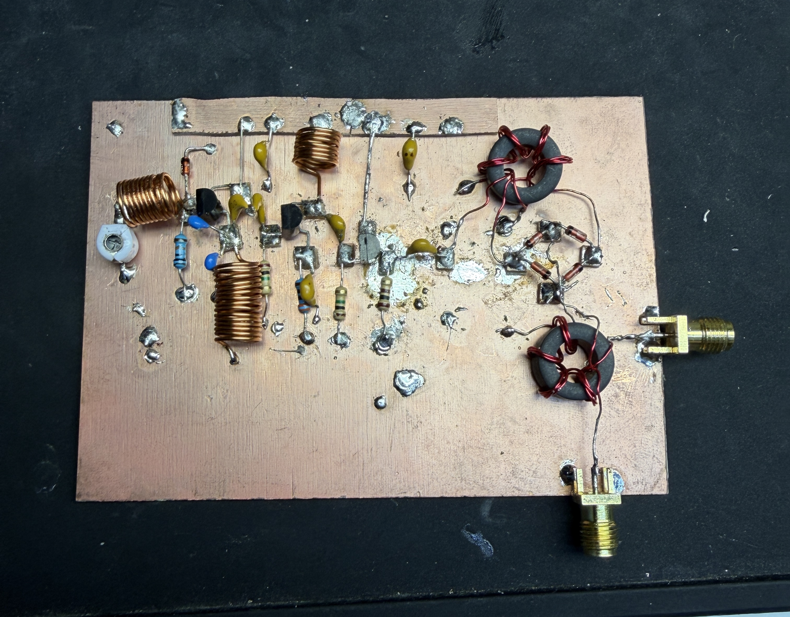

---
hide:
  - navigation
---

  <h1 class="hero-title">Building an FM superheterodyne receiver, by hand, from first principles.</h1>
  
Evan Gray — incoming MSEE, UCLA ECE (electromagnetics, antennas, RF/microwave). A record of the circuits, the math behind them, and the tools built along the way.

  <a class="hero-cta" href="projects/fm-superhet/">View the build</a>

  

  <a class="bench-card" href="tools/">
    <h3>Tools</h3>
    
Smith Bench and other utilities built for this work.

  </a>
  <a class="bench-card" href="notes/">
    <h3>Notes</h3>
    
Mixer theory and RF measurement fundamentals.

  </a>

