---
hide:
  - navigation
---

# FM Superheterodyne Receiver

A full FM broadcast-band (88–108 MHz) superheterodyne receiver. The core blocks are: RF preselector, LO + mixer, IF diplexer + IF amplifiers, FM detector, audio stage. 

This writeup documents the overall architecture considerations and the design and implementation of the now complete front-end. The remaining elements of the receiver chain are in-progress.

## Current architecture

- **RF Preselector** — Antenna into a broadband, tracking preselector, straight into the mixer's RF port. No RF amp stage — signal levels in downtown Chicago are strong enough that one isn't needed, and keeping a moderate RF swing into the mixer was a design goal.
- **Local oscillator** — A JFET (J310) Clapp oscillator, buffered by an amp and follower stage, delivers a flat +6 dBm into the mixer across 98.7–118.7 MHz.
- **Mixer** — Diode-ring mixer (1N5711 Schottky diodes, hand-wound trifilar transformers on FT50-61 toroids).

## Motivation 

My passion for RF circuits and antennas is boundless. While my ultimate interests lie in microwave frequency, distributed-element design, I have such an appreciation for discrete, lumped-element transistor circuits in the radio domain. Not only are they wonderfully intricate bits of engineering capable of processing signals that oscillate a million times per second, but they serve as a critical stepping-stone into the RF domain. Many, if not all, of the ideas developed during the 60s and onwards in the analog RF realm translate directly into modern microwave engineering.

This project, a discrete, lumped-element FM receiver, sits precisely at that stepping-stone. A superheterodyne FM receiver touches nearly every fundamental building block of RF engineering in miniature: an LC-tuned front-end for image rejection, a local oscillator and mixer for frequency translation, an IF filter and limiter chain, and finally FM demodulation. Each of these stages, built here with discrete BJTs or JFETs and hand-wound inductors, has a direct microwave analog, from microwave cavities to rat-race diode ring mixers.

Walking through this receiver by hand, toiling with design approaches, and directly measuring build outcomes, are deliberate choices to internalize the physics and engineering intuition applicable at all wavelengths: gain, noise figure, stability, impedance matching, etc. The switch to the distributed-element world, then, becomes a far less jarring transition.

My specific goals for this project are quite simple: to learn as much as I can about receiver architecture, measurement techniques and instrumentation, and RF circuit realization. In achieving these milestones, I just hope to be able to hear FM stations with decent quality. If I can do that, my general goal will have been met, with my more particular, pedagogical interests no doubt satisfied by proxy.

## Architecture overview for a Superheterodyne Receiver

Below is the block diagram for a fairly standard superheterodyne receiver. I say *fairly standard* because a more robust design will often use a low-noise amplification stage after the antenna to boost RF signal strength while setting the baseline for **noise figure**. My design forgoes this stage because I plan to receive in RF dense cities like LA and Chicago. In this sense, I expect the incoming RF to already be fairly healthy (if not too strong to require attenuation).

<figure>
  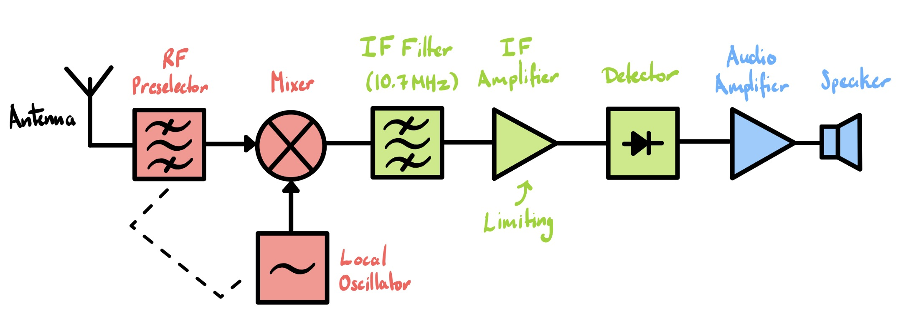
  <figcaption>Simplified block diagram for the FM superheterodyne receiver.</figcaption>
</figure>

An advantage of this LNA-less approach, outside of simplicity, is that the signal chain includes one fewer sources of nonlinear distortion. However, this design sacrifices sensitivity to weak signals and control over initial noise figure. For a homebrew design, these are acceptable trade-offs.

Beyond this change, the full signal chain — of which this front end is the first stage — is textbook superhet:

**Built:**

- RF preselector.
- Local oscillator + mixer.

**Planned next:**

- IF filter (including an IF diplexer).
- IF amplifier chain (limiting, if possible).
- Detector.
- Audio stage.

## Local Oscillator and Mixer

In any superhet design, the **local oscillator** (LO) + **mixer** network is probably the most challenging circuit to implement and one of the most critical components of the front-end overall. Being early in the signal chain, any problems that arise in this block will invariably propagate through to the system output. In my design specifically, this is the first active block, and thus is especially limiting when it comes to reception quality. All in all, the mixer and LO blocks are notoriously complex in design and implement.

For reference, a mixer converts RF into an **intermediate frequency** (IF) signal by multiplying it with a locally furnished LO signal, generating sum and difference products. The LO is synthesized by some kind of **variable frequency oscillator** (VFO) located nearby, while a deliberately nonlinear device or switching circuit provides the mixing action. Mathematically, an ideal mixer produces an output signal of the form

\begin{equation}
    V_\text{out}(t) = \frac{kV_\text{lo}V_\text{rf}}{2}\big[\cos((\omega_\text{lo} - \omega_\text{rf})t) + \cos((\omega_\text{lo} + \omega_\text{rf})t)\big].
\end{equation}

In short, the mixer + LO block's primary function is to produce the desired IF signal, $\omega_\text{IF} = \omega_\text{LO} \pm \omega_\text{RF}$. It is the case that both signal generation and signal conversion are arguably simple tasks to achieve in isolation, but very difficult to unify with even adequate performance.

Speaking of performance, because our end-goal is a clean IF, we are concerned mostly with how the mixer behaves at its output. LO-side issues are less critical down the line, and can be tuned qualitatively. Practically, then, the most critical figure of merit in the design and evaluation of a mixer is **conversion gain**, given by

\begin{equation}
    \text{Conversion Gain (dB)} = 10\log_{10}\!\left(\frac{P_\text{IF}}{P_\text{RF}}\right).
\end{equation}

It is important to optimize around this quantity because it sets a limit on the overall system's noise figure. That is, any noise introduced in this early stage dominates the entire system's performance. Furthermore, the lower the conversion gain, the more likely it is a weak signal will become buried in the noise floor and thus impossible to later recover. 

A secondary, but equally relevant figure is **third-order intercept point** (IP3). This is a good measure of a mixer's unintended nonlinearity at the RF port, prior to the mixing action. We write

\begin{equation}
    \text{IP3}_\text{out} = P_\text{fundamental} + \frac{P_\text{fundamental} - P_\text{IMD3}}{2}.
\end{equation}

Critically, third-order premixing of the RF signal can result in *ghost* frequencies appearing at the RF port which are extremely close to the genuine RF. These **spurious signals** can then mix down to the IF band, becoming impossible to filter out.

For more details on the theory of mixers and oscillators, refer to the **[Mixer Theory](../../notes/mixer-theory.md)** and **Oscillator Theory** sections on the notes page. Additional information on measurement figures can be found in the **[RF Measurement Parameters](../../notes/rf-measurement-parameters.md)** section.

### Design

#### Local Oscillator Circuit 

Starting with the LO circuit, my aim was a relatively flat and strong drive across the highside FM band (98.7 to 118.7 MHz). Regardless of the chosen mixer topology, a decent output level would be necessary, and flatness ensures the mixer's drive requirement is met consistently.

Even before starting this project, I had long been familiar with the **Clapp** topology, having built the circuit a few times at HF. This circuit provides greater stability over a wider band as compared with its Colpitts and Hartley predecessors. Achieving this significant improvement only requires the addition of a single, third capacitor (C3), which often doubles as the tuning element. Furthermore, I wished for the active circuit to be in common-collector or common-drain configuration for lowered output impedance and more uniform loop gain. Overall, I considered two variations of this circuit:

- **BJT (KSP10)** active device — A bipolar transistor gives greater loop gain and, therefore, startup margin. It also provides greater raw LO drive. However, bandwidth can be limited at VHF, and base loading effects can perturb the reactive network.

<figure>
  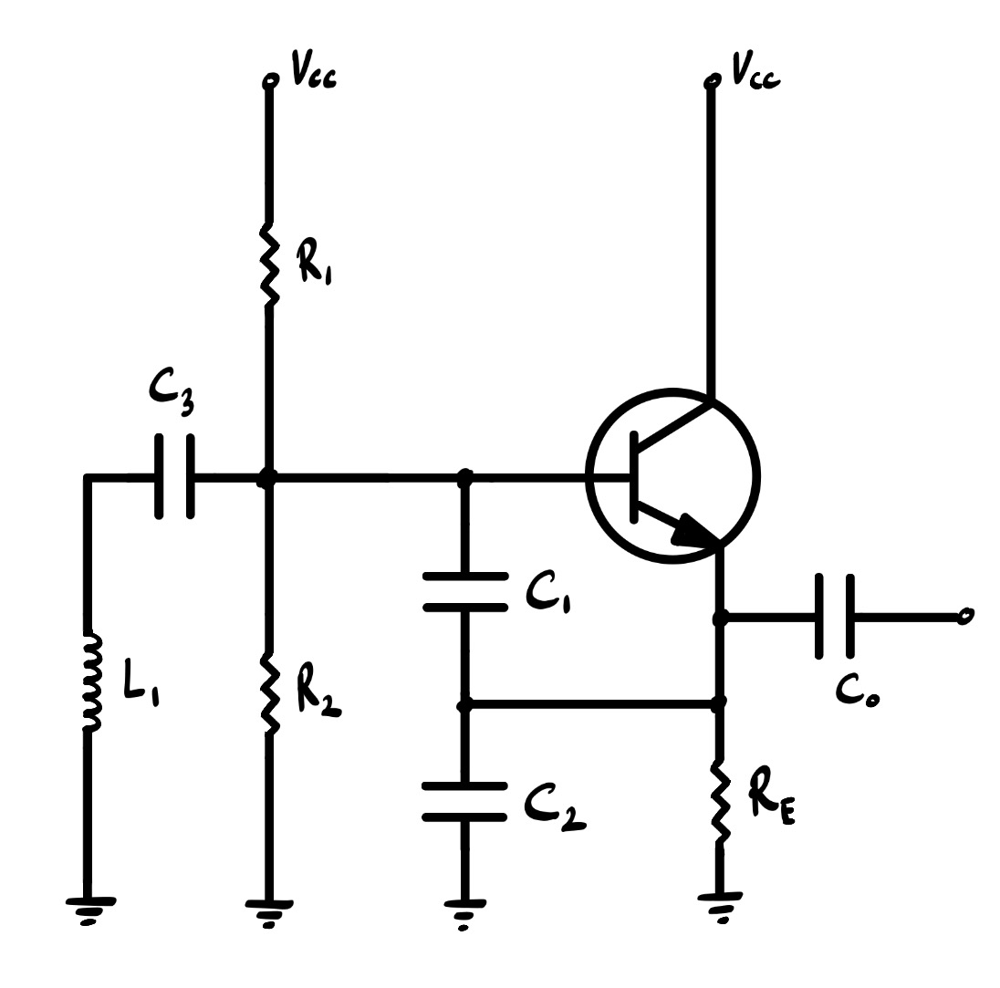
  <figcaption>BJT Clapp oscillator circuit diagram.</figcaption>
</figure>

- **JFET (J310)** active device — While a FET suffers in terms of startup margin due to its relatively lower transconductance, it shines in other areas. The J310 is generally superior at VHF and UHF with its higher transition frequency. Also, a FET has nearly zero gate loading effects on the resonant tank. Moreover, while biasing can be somewhat tedious due to process inconsistencies, the circuit requires fewer components overall.

<figure>
  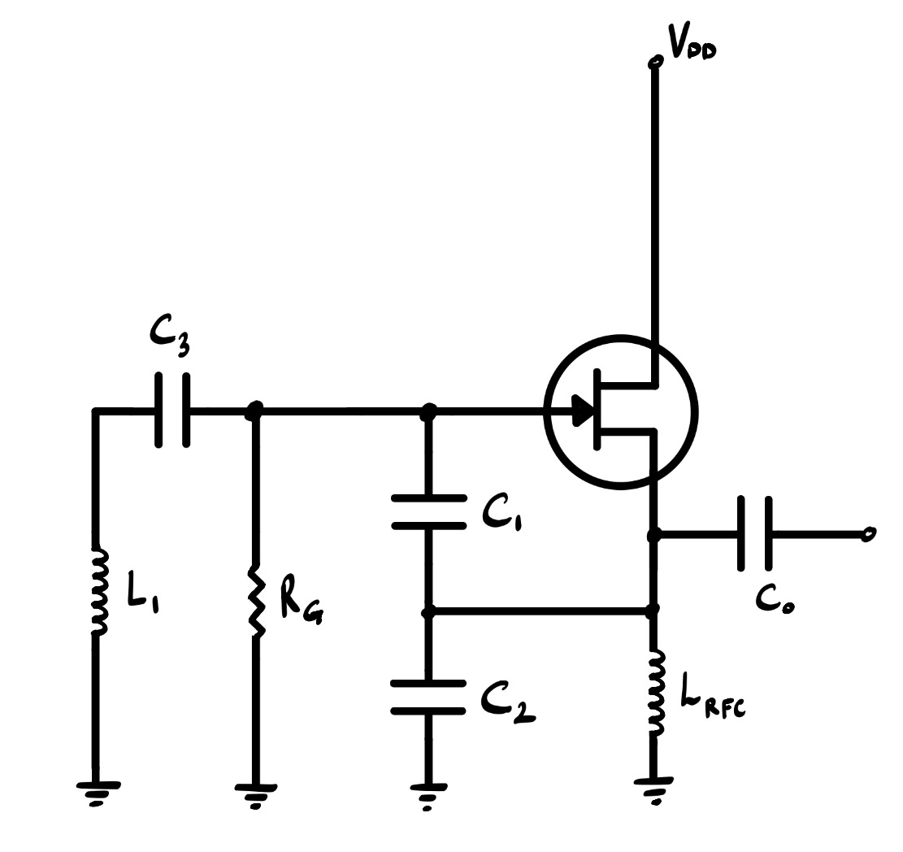
  <figcaption>JFET Clapp oscillator circuit diagram.</figcaption>
</figure>

Both circuits are nearly identical. They share a startup condition, given by

\begin{equation}
    g_m \ge \omega^2C_1C_2R_p,
\end{equation}

where $R_p$ is the effective tank loss (dominated by the inductor's effective series resistance). As stated above, the JFET has a lower transconductance, and thus has a tighter startup margin. To counteract this, we place an RF choke in the source leg to pin the source current to $I_S \approx I_{DSS}$. For the BJT approach, this issue is rarely encountered, and the startup condition is often easily met with a prudent choice of $C_1$ and $C_2$. 

To attain the desired tuning range, the tank can be viewed as a series resonator. It is beneficial to choose $C_1 = C_2 > C_3$ for wideband stability. Then, the oscillator frequency is given by

\begin{equation}
    f = \frac{1}{2\pi\sqrt{L_1\cdot C_\text{eff}}}, \quad C_\text{eff} = \frac{1}{\frac{1}{C_1} + \frac{1}{C_2} + \frac{1}{C_3}}.
\end{equation}

For a detailed analysis of this circuit topology and the origin of these equations, read **Clapp Oscillator Small-Signal Analysis and Design**.

In the case of this project's design, I ended up choosing the JFET since its near-zero loading on the tank mattered more to me than the BJT's superior startup margin. Also, the J310 is a well established VHF device, giving me more confidence in broadband flatness compared to the BJTs I had in my parts bin.

Because I ended up choosing a passive commutating circuit for the mixer core (more on this in the mixer section below), amplification of the LO drive would become unavoidable for good conversion performance. Specifically, with the LO expected to provide unity gain at a 50 $\Omega$ reference impedance, an amplification stage sized for a gain of roughly +7 dB was necessary to meet the mixer's requirements. Further, given an oscillator's sensitivity to **load pulling** and reactive perturbations, output buffering is vital. A JFET source follower was chosen for its massive gate impedance and simplicity. Below is the full LO circuit with these inclusions considered.

<figure>
  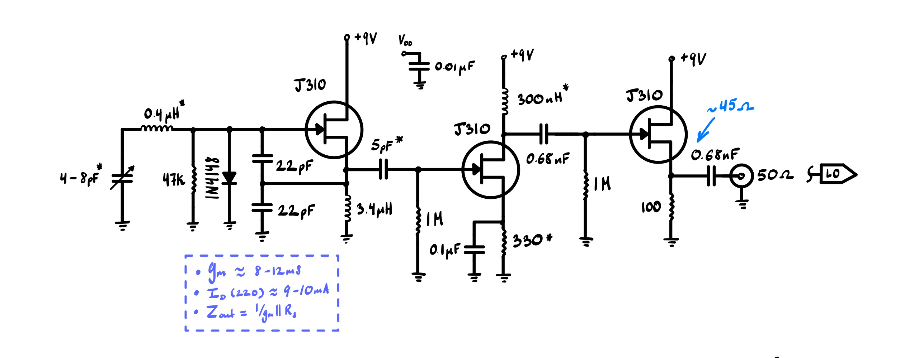
  <figcaption>Final local oscillator circuit.</figcaption>
</figure>

The output impedance of this circuit was tuned to 50 $\Omega$ for driving the mixer port. Estimating the device's transconductance to be $g_m \approx 12$ mS, and employing a 100 $\Omega$ source resistor in the follower stage, the output impedance is

\begin{equation}
    \frac{1}{g_m}\,||\,100\,\Omega \approx 45\,\Omega.
\end{equation}

This is a good analytic estimate, adjusted on the bench to meet the target impedance.

Evidently, a few modifications have been made to the LO circuit (added diode, swapping $L_1$ and $C_3$), each of which came out of empirical iteration; see the implementation section. 

#### Mixer Circuit

The mixer topology for the downconversion network varied significantly throughout the planning process. My key requirements were maximized conversion gain, so as to avoid excessive IF amplification, and acceptable LO-RF isolation. I considered the following options:

- **Single JFET mixer** — The core advantage of using a JFET for mixing is that it provides conversion gain, one of my primary requirements. It is also a simple device to bias and operate. Furthermore, transistors can be loaded by a tuned circuit for immediate selectivity and output coupling/impedance transformation. However, single-device mixers tend to have extremely poor isolation. They can also be somewhat bandwidth limited, especially if input matching isn't already broadband. Lastly, because these kinds of mixers rely on their nonlinear (second-order) behavior, third-order intermodulation becomes more of a concern.

<figure>
  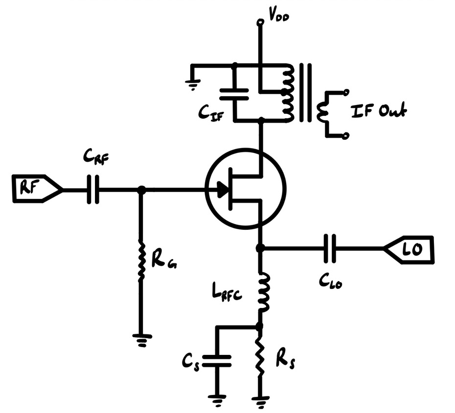
  <figcaption>Single JFET mixer circuit.</figcaption>
</figure>

- **Dual-gate MOSFET mixer** — The dual-gate MOSFET has essentially the same advantages and disadvantages as the single JFET mixer. However, it has significantly improved isolation, owing to simultaneous gate injection. Nevertheless, high-frequency junction capacitances will always contribute to reverse coupling, as with any semiconducting device.

<figure>
  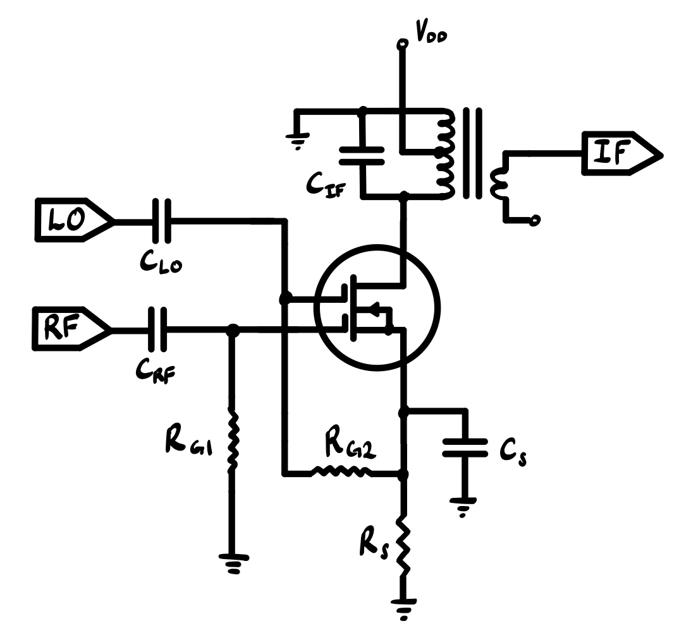
  <figcaption>Dual-gate MOSFET mixer circuit.</figcaption>
</figure>

- **Diode ring mixer** — The classic diode ring solves many of the problems posed by nonlinear, single-device mixers. Critically, they are balanced networks and rely on commutation/current steering for mixing, rather than inherent device nonlinearity. These two properties give them excellent isolation in all directions, superior linearity, and wide bandwidth. Furthermore, they are relatively simple to build, requiring only 4 diodes and a pair of trifilar transformers. The price that must be paid for these conveniences and  benefits is significant LO drive to fully switch the diodes, and unavoidable conversion loss. Additionally, the 4 diodes must be closely matched.

<figure>
  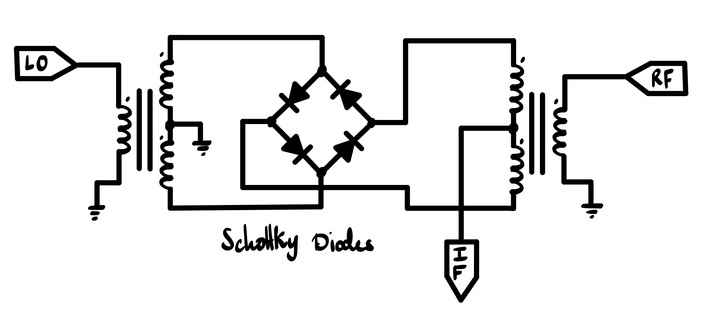
  <figcaption>Diode ring mixer circuit.</figcaption>
</figure>

I went back and forth with all of these variations during the planning stage of this project. The diode ring mixer would have been my first choice, but I had, at the time, never wound transformers, and had no VHF toroid on hand. The JFET mixer was an attractive, simple approach that I was sure I would eventually pick. However, I grew more and more concerned with its poor LO-RF isolation, especially given that I can't risk broadcasting any FM whatsoever. I eventually landed on the dual-gate MOSFET mixer, it being a well-documented circuit in the amateur HF-band community, and one that solves the reverse isolation issues somewhat. But, again, I grew concerned with its performance at VHF; besides the fact I had no dual-gate MOSFETS on hand. 

Ultimately, I returned to and settled on the diode ring. It is one of the easier circuits to physically build, requiring only that I wind my own trifilar transformers and hand-match a set of 4 diodes. At the same time, it provides excellent performance, rivaling even professional implementations at the cost of a single amplification stage in the LO chian (see the LO circuit section). Below are the diode and winding specifications:

- Diodes: 1N5711; fast-switching, high-frequency, low turn-on voltage Schottky diodes. These were matched to within 1 mV of one another (each with 0.280 V forward drop) using a basic multimeter. Purchased on Amazon.
- Transformers: 3-4 turns of 26 AWG wire, trifilar wound. Three strands of 6-inch long wire twisted together at 4-8 twists-per-inch. FT50-61 toroid, which functions well for transformers up to 400 MHz. Purchased on Amazon.

### Implementation

With the design settled on paper, actually bringing the LO circuit up on the bench told a different story. Several of the choices above only emerged after some back-and-forth. The oscillator itself needed a handful of fixes before it behaved, and getting flat gain into the mixer took a separate round of trial and error on the buffer chain. The mixer itself was a relatively smooth process.

#### Local Oscillator Implementation

**Iteration 1 — BJT Clapp.** I built the Clapp oscillator first using a KSP10 bipolar transistor exactly per the design of $\S$4.1. This circuit started and oscillated reliably, but flatness was extremely poor, dropping by ~6 dB at the top of the band (118.7 MHz). Furthermore, harmonic suppression was ~10 dB at 98.7 MHz and rose to ~17 dB at 118.7 MHz. My initial instinct was that the tuning capacitor, being a cheap, general-purpose trimmer, was losing Q at the high end of the band. Swapping it out had no impact on either figure.

<figure>
  
  <figcaption>Bench prototype of a BJT-based Clapp oscillator.</figcaption>
</figure>

**Iteration 2 — swap to JFET.** I then reached for a more reliable VHF device, the J310 JFET, hoping it would provide improved gain performance. JFETs are also known to be excellent active devices for oscillators, owing to their low noise figure and high gate impedance. Initially, I just dropped the JFET directly in place of the BJT and replaced the base divider with a 1 M$\Omega$ resistor for rebiasing. The circuit initially failed to oscillate. I quickly realized that the JFET's lower transconductance hindered startup margin, so I replaced the source resistor with a large RF choke. Oscillations then initialized reliably, at the expense of massive source currents in the 33 mA range (my J310's $I_{DSS}$). Ultimately, gain droop reduced to ~4 dB at the top of the band, and harmonic suppression improved by ~8 dB across the band (still uneven, but overall better).

**Iteration 3 — addition of AGC diode.** I decided to reference *Solid-State Design for the Radio Amateur* for improvements to the oscillator circuit. I noticed that in nearly every oscillator this book discussed, a silicon diode was placed across the tank circuit, from gate to ground. Such a diode acts as a passive kind of **automatic gain control**. When the diode is run into conduction by excessive voltage swing, the inherent RC characteristic of the gate (bias resistor and input capacitance) work to shift the DC operating point and reduce gain. It also seems to significantly reduce the device's overall operating current, ensuring it never enters saturation, improving harmonic distortion. Upon adding this diode (1N4148), both flatness and harmonic suppression improved to ~3 dB and ~25 dB across the band, respectively. Note that it was necessary to reduce the gate resistor from 1 M$\Omega$ to 47-100 k$\Omega$ to achieve this result.

<figure>
  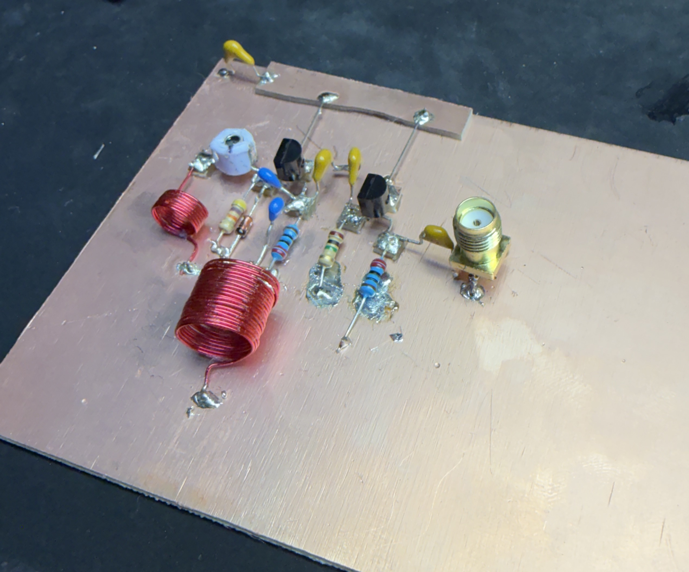
  <figcaption>Bench prototype of a JFET-based Clapp oscillator. A diode is now placed across the resonant circuit and a source follower has been added.</figcaption>
</figure>

Observe that a source follower has also been added to the circuit. This was purely for testing purposes. I wished to prevent the possibility of loading-down the oscillator with my measurement device. I also wanted to obtain proper 50 $\Omega$ measurements, since that is roughly what the diode ring presents. Furthermore, it was at this point that I decided for my output coupling capacitor to be ~5 pF so as to ensure a light tap of the tank (source node).

**Iteration 4 — L1/C3 swap.** I had noticed throughout testing and sweeping the trimmer that while harmonics remained suppressed, some of the LO's flatness would suffer. This was clearest after dropping in the source follower. Indeed, it was my suspicion that solely adding the AGC diode was not a complete solution. Namely, it had been a constant concern of mine that the tuning capacitor was also the very capacitor coupling the resonant circuit to the active device. Furthermore, I had in my own experience, as well as in the aforementioned solid-state radio textbook, observed many oscillator designs use a fixed coupling capacitor alongside a larger tuning network in parallel with the inductor. Other designs simply place the inductor ahead of the capacitor in the series chain. I attempted the latter approach and this significantly improved flatness.

<figure>
  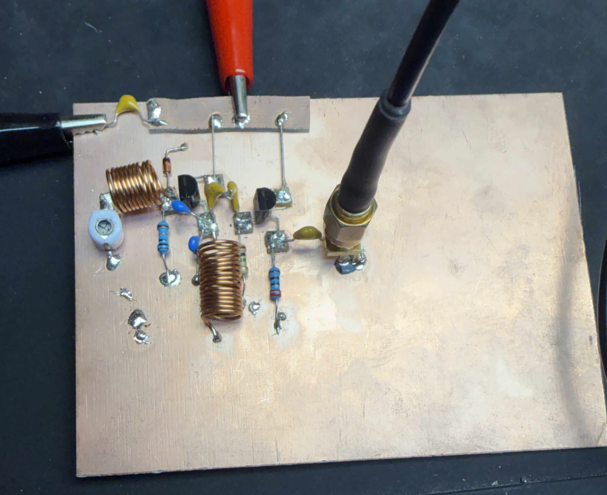
  <figcaption>Bench prototype of a JFET-based Clapp oscillator. The tank inductor and trimmer capacitor have been swapped.</figcaption>
</figure>

With the oscillator itself behaved, the remaining problem was absolute gain and isolation into the mixer. I tried several amp/follower orderings in the buffer chain:

| Configuration | Result |
|---|---|
| Amp → Follower | Minimal gain present, flatness poor. |
| Follower → Amp | Unexpected loss instead of gain. |
| Amp → Follower (choke-loaded) | Hit target gain, flatness still off. |
| Follower → Amp → Follower | Loss again. |
| Amp → Follower, RFC retuned | **Flat +6 dBm into mixer — final**. |

I struggle to explain why the resistor-loaded amplifier approach failed to produce anywhere near the gain I was expecting. It was even less clear why preceding the amp-follower chain with a follower right off the LO resulted in significant loss. Recall, I measured near-unity gain when measuring the LO signal off of a lone source follower. Nevertheless, loading the bare amp-follower with an RF choke finally amounted to tangible gain, in line with the theoretical predictions. However, I found that too large of a choke both hindered flatness yet again and reduced said gain. I can only assume that the choke formed some kind of resonant load with the JFET's internal capacitance or any stray board capacitance, resulting in the amplifier's gain peaking within a narrow frequency range.

<figure>
  
  <figcaption>Bench prototype of a JFET-based Clapp oscillator. A buffer-amplifier has been added to the circuit.</figcaption>
</figure>

#### Mixer implementation

Rather unexpectedly, building and installing the mixer was a fairly smooth process. This was my first time winding a transformer, so I followed a classic approach mentioned in the aforementioned textbooks:

- First, the trifilar wire needed to be twisted together to ensure even and meaningful coupling. I took 3 ~6 inch strands of 26 AWG enameled wire and pressed their ends into a drill socket while holding the loose ends with pliers. I then ran the drill slowly until I observed 4-8 twist per inch develop along the set of wires.
- Next, I prepared my toroid by feeding a paint brush through its center and mounting it in a vice. I then passed the trifilar wire bundle into the center hole 4 times, resulting in 4 loops. Each end of the wire triple resided on opposite sides of the toroid. 
- Finally, I untwisted the loose ends, stripped their enamel coatings, and checked continuity to match the individual wires. At this point, all that remained was to form the center-tap by finding two distinct wire ends, each on **opposite** sides of the toroid, and twist them together.

<figure>
  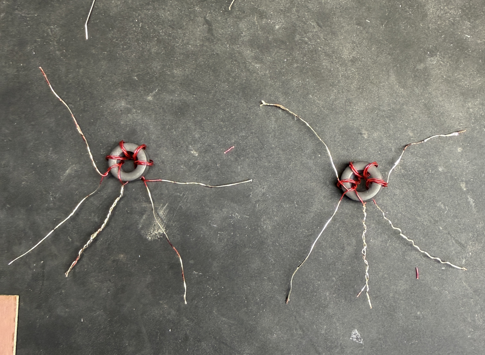
  <figcaption>Trifilar-wound toroidal transformers with center-tap realized.</figcaption>
</figure>

The choice of 4 turns arises from the rule-of-thumb that the external port, in this case the LO or RF, should present several times the impedance of the network, the diode ring, at the center frequency. Since the diode ring is expected to present ~50 $\Omega$, 4 turns is a reasonable choice. Of course, the diode ring presents a dynamic impedance, so this is only a rough estimate.

With the transformers ready, all that was left was to match 4 diodes and to build the circuit. Indeed, using a simply bench multimeter, I matched several diodes to 280 mV exactly. This ensures even switching across the LO swing, as well as a somewhat more balanced impedance profile.

<figure>
  
  <figcaption>Finalized board with the diode-ring mixer implemented.</figcaption>
</figure>

Because this is now a cascaded system, specific details as to the performance of the mixer are presented in the following section.

### Bench Check

While several intermediate measurements were conducted during the implementation of the front-end, this section presents the key output figures. 

#### Local Oscillator Results

Below is the spectrum of the buffered and amplified LO signal. Critically, the fundamental power level remains within 1 dB across the tuning range. While it is not visible on the static plot, the LO gain is monotonic throughout the span.

Furthermore, the output level sits right around 5-6 dB (add 30 dB to the plot markers), only just below a standard diode-ring mixer's requirements. Nevertheless, 6 dB is approximately 0.45 V in a 50 $\Omega$ system, which is more than adequate to properly switch a 0.28 V diode. 

We also see that the second harmonic lies 20-22 dB below the fundamental uniformly. Not only is this already a very acceptable level of harmonic distortion, but a balanced mixer is expected to significantly suppress even-order harmonics, further improving performance.

<figure>
  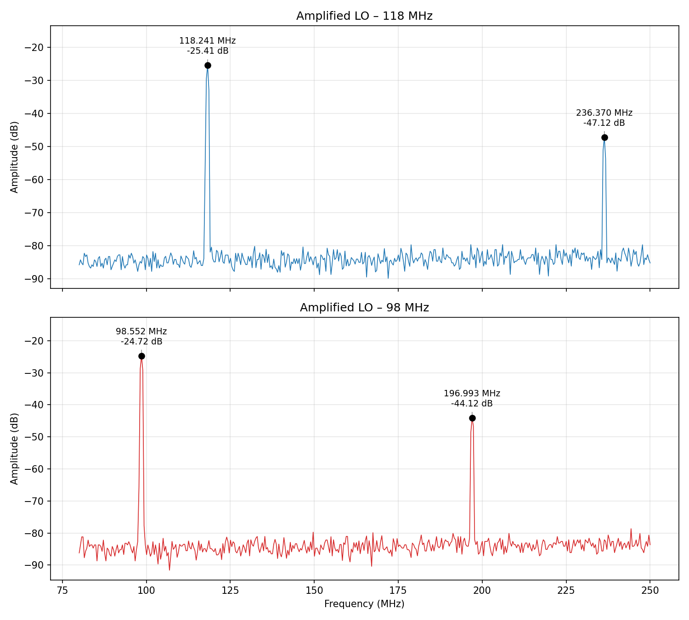
  <figcaption>LO output spectrum at the buffer-amplifier port. A 30 dB attenuator is in-line.</figcaption>
</figure>

This data meets my original target specifications almost exactly. In the future, I would only budget for a drive level that slightly exceeds the mixer's specifications.

#### Mixer IF Results

Finally, the plot below illustrates the IF port spectrum given a -5 dB, 40 MHz RF input tone, from which several key parameters can be extracted. The most important qualitative feature of the spectrum is the two distinct sidebands residing at the LO-to-RF sum and difference frequencies. These peaks indicate that second-order mixing has been achieved at some level. More specifically, we measure a ~-10 dB (add 30 dB to the plot markers) low-side IF at both band edges, implying a conversion loss of ~5 dB. This is an excellent result, exceeding my initial specifications and expectations.

Additionally, the data indicates ~28 dB of LO-to-IF isolation and ~40 dB of RF-to-IF isolation. These are also excellent results, and they align with the reputation of the diode-ring mixer.

The 2nd LO harmonic is suppressed by ~51 dB, as was predicted in the preceding LO results section. While not on this plot, the 3rd harmonic is almost equally suppressed, though only because it was never inherently strong.

<figure>
  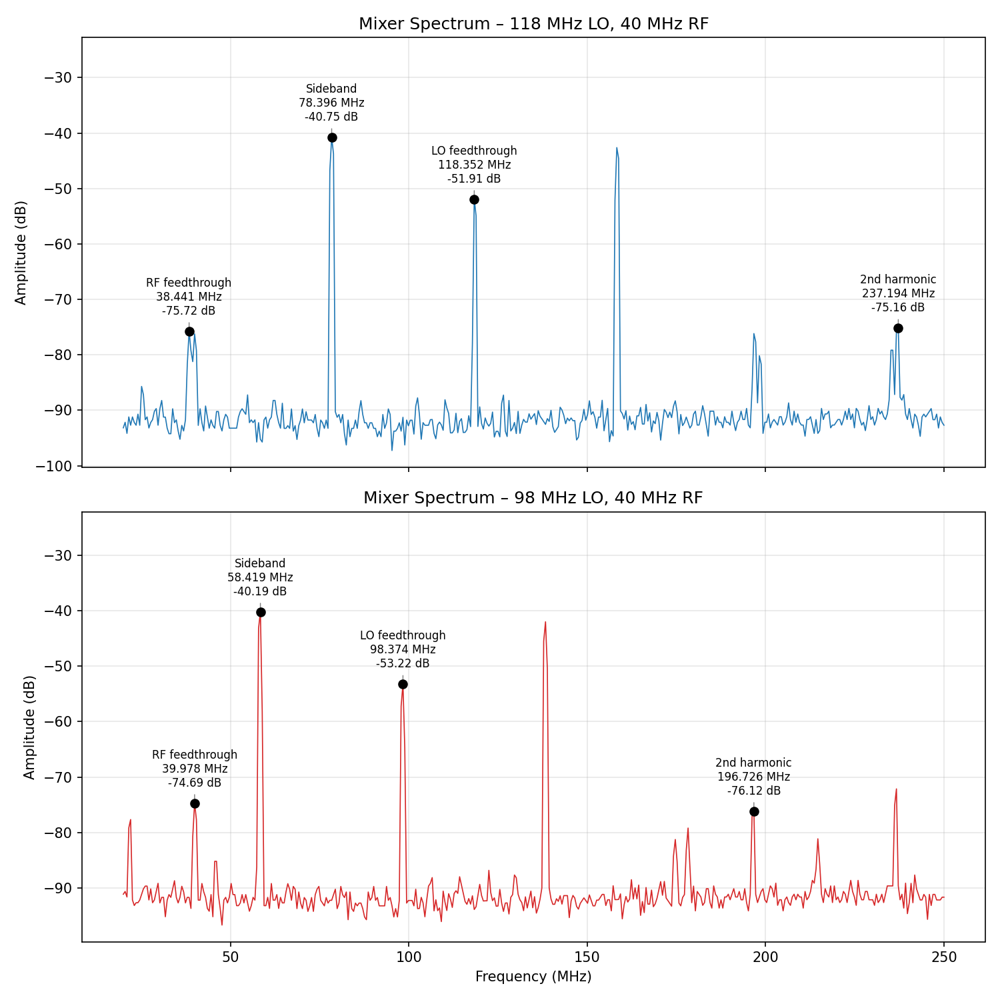
  <figcaption>Mixer output spectrum at the IF port. A 30 dB attenuator is in-line.</figcaption>
</figure>

As with the LO circuit, the mixer data meets, if not totally exceeds, the design specifications.

#### Summary

| Parameter | Result |
|---|---|
| LO output level | +5–6 dBm, flat within 1 dB across 98.7–118.7 MHz |
| LO harmonic suppression | 20–22 dB below fundamental |
| Mixer conversion loss | ~5 dB (measured at band edges) |
| LO-to-IF isolation | ~28 dB |
| RF-to-IF isolation | ~40 dB |
| 2nd LO harmonic (at IF port) | ~51 dB suppressed |

## Conclusion

With these results, the RF front-end is complete and meets its original design targets across the board. The next stage — IF filtering, amplification, and detection — picks up directly from the mixer's IF port demonstrated here. Even as a standalone milestone, this front-end already exercises the core skills I set out to develop: oscillator design, mixer topology selection, transformer winding, and firsthand RF measurement.
